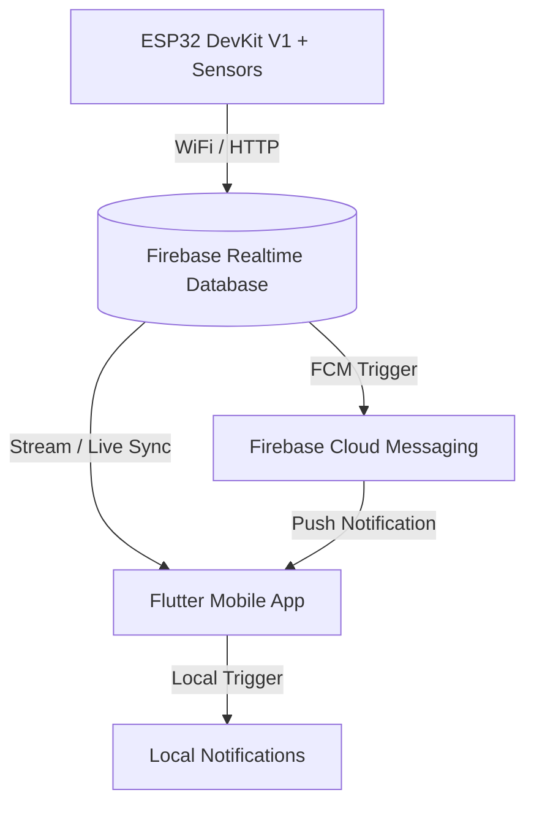

# 🌡️ IoT Fire Detection & Environment Monitor Dashboard

Aplikasi mobile dashboard berbasis **Flutter** dan **Dart** yang dirancang untuk memantau data sensor lingkungan secara real-time dari perangkat **ESP32** melalui **Firebase Realtime Database**. Aplikasi ini dilengkapi dengan sistem notifikasi pintar untuk mendeteksi potensi bahaya kebakaran dan asap secara instan.

Project ini dikembangkan sebagai tugas kuliah untuk mata kuliah **Mobile & IoT**.

---

## 🚀 Fitur Utama

- **Real-time Monitoring Dashboard**: Memantau suhu (°C), kelembaban (%), kadar gas/asap secara real-time dengan status indikator keamanan yang responsif (Aman, Asap Terdeteksi, Potensi Kebakaran).
- **Grafik Historis Interaktif**: Menyajikan visualisasi data historis sensor dalam bentuk chart tren dinamis untuk memantau perubahan kondisi ruangan dari waktu ke waktu.
- **Sistem Notifikasi Cerdas**:
  - Mengintegrasikan **Firebase Cloud Messaging (FCM)** untuk menerima pesan push notification.
  - Memanfaatkan **Flutter Local Notifications** untuk memicu peringatan otomatis langsung dari aplikasi saat terjadi perubahan status sensor (misal: transisi ke status berbahaya).
- **Log Peringatan (Alert Logs)**: Halaman khusus yang menyimpan rekaman semua peringatan bahaya yang pernah terjadi beserta detail kondisi sensornya.
- **Pengaturan Ambang Batas (Threshold Configuration)**: Konfigurasi sensitivitas sensor (batas suhu dan kelembaban) serta opsi aktif/nonaktif notifikasi tertentu langsung dari aplikasi.
- **Automated Mock/Simulasi Mode**: Jika aplikasi tidak terhubung ke Firebase, sistem secara otomatis beralih ke *Simulated Stream* yang mensimulasikan siklus perubahan kondisi ruangan (Aman $\rightarrow$ Asap Terdeteksi $\rightarrow$ Potensi Kebakaran $\rightarrow$ Aman) untuk kebutuhan presentasi dan pengembangan lokal.

---

## 🛠️ Teknologi & Komponen

### Perangkat Lunak (Software)
- **Framework**: Flutter (Dart)
- **Database**: Firebase Realtime Database
- **Push Notification**: Firebase Cloud Messaging (FCM)
- **Local Notification**: Flutter Local Notifications Plugin
- **Grafik**: Charting library untuk Flutter

### Perangkat Keras (Hardware & Sensor)
- **Mikrokontroler**: ESP32 DevKit V1
- **Sensor Suhu & Kelembaban**: DHT22
- **Sensor Kualitas Udara / Gas**: MQ-2 / MQ-135

---

## 📊 Arsitektur Sistem



---

## 📁 Struktur Folder Proyek (`lib/`)

Struktur kode sumber utama aplikasi terorganisir dengan rapi sebagai berikut:

```text
lib/
├── main.dart                  # Entry point aplikasi & inisialisasi Firebase/Notifikasi
├── screens/
│   ├── home_screen.dart       # Dashboard utama, status hero card, & tab navigation
│   ├── chart_screen.dart      # Grafik historis sensor real-time
│   ├── alert_screen.dart      # Riwayat log notifikasi bahaya
│   └── setting_screen.dart    # Konfigurasi threshold sensor & switch notifikasi
├── widgets/
│   ├── sensor_card.dart       # Komponen visualisasi nilai Suhu & Kelembaban
│   ├── smoke_level_gauge.dart # Radial gauge visualisasi tingkat asap (Rendah - Tinggi)
│   └── mini_stat_card.dart    # Komponen card kecil penampil informasi status ringkas
└── services/
    ├── firebase_service.dart  # Handler koneksi Firebase & generator mock data stream
    └── notification_service.dart # Handler integrasi FCM & Flutter Local Notifications
```

---

## ⚙️ Cara Menjalankan Aplikasi

### 📋 Prasyarat
- **Flutter SDK**: Versi `3.12.0` ke atas.
- **Dart SDK**: Terintegrasi di dalam Flutter SDK.
- **Editor**: VS Code atau Android Studio dengan ekstensi Flutter & Dart.
- **Emulator / Device**: Perangkat fisik Android/iOS atau emulator untuk testing.

### 🏃 Langkah-langkah
1. **Clone repository**
   Pilih salah satu sesuai dengan repositori yang ingin Anda gunakan (repositori utama / parent, atau hasil fork):
   ```bash
   # Clone dari repositori utama (parent)
   git clone https://github.com/ajikharisma/uas_mobile_iot.git
   cd uas_mobile_iot

   # ATAU clone dari repositori hasil fork Anda
   # git clone https://github.com/HafizhHabiibi/project-kuliah-miot-firedetection-app.git
   # cd project-kuliah-miot-firedetection-app
   ```

2. **Dapatkan Dependencies**
   Unduh semua library yang diperlukan melalui Flutter CLI:
   ```bash
   flutter pub get
   ```

3. **Jalankan Aplikasi**
   Pastikan perangkat uji atau emulator Anda sudah aktif, kemudian jalankan:
   ```bash
   flutter run
   ```

---

## 🔥 Panduan Integrasi Firebase & Hardware

Secara bawaan (*default*), aplikasi akan berjalan dalam **Demo Mode** menggunakan simulasi sensor jika Firebase belum terkonfigurasi. Untuk menghubungkan aplikasi dengan hardware fisik dan Firebase asli Anda:

### 1. Konfigurasi Firebase
1. Buat proyek baru di [Firebase Console](https://console.firebase.google.com/).
2. Daftarkan aplikasi Android dan iOS Anda ke dalam proyek tersebut.
3. Unduh berkas konfigurasi:
   - Android: `google-services.json` $\rightarrow$ Letakkan di folder `android/app/`
   - iOS: `GoogleService-Info.plist` $\rightarrow$ Letakkan di folder `ios/Runner/`
4. Aktifkan **Realtime Database** pada regional terdekat (misal: Singapore / `asia-southeast1`).
5. Buat struktur path database seperti berikut:
   ```json
   {
     "sensor": {
       "history": {
         "pushId_1": {
           "temperature": 29.5,
           "humidity": 62.0,
           "gasValue": 420,
           "smokeLevel": "Normal",
           "status": "Aman",
           "timestamp": 1718910000000
         }
       }
     }
   }
   ```

### 2. Hubungkan ESP32
1. Unggah kode program mikrokontroler Anda (Arduino IDE / PlatformIO) ke ESP32.
2. Pastikan ESP32 mengirimkan data ke path Firebase Realtime Database Anda di `/sensor/history` menggunakan format JSON di atas setiap kali terjadi pembaruan pembacaan sensor.

---

## 📄 Lisensi & Kontributor

- **Mata Kuliah**: Mobile & IoT (MIoT)
- **Developer**: Kelompok IoT / Hafizh Habiibi & Tim
- **Lisensi**: Bebas digunakan untuk keperluan akademik dan edukasi.
